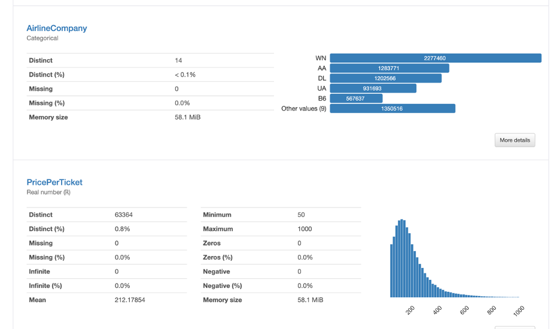

# Flight Fare Prediction

## 📝 Overview
The Flight Fare Prediction project aims to predict airline ticket prices based on key features like origin, destination, distance, and airline. It combines data cleaning, exploratory analysis, and machine learning to build a predictive model. The project also includes a Flask-based web application that allows users to input flight details and receive fare predictions.

---

## 📂 Repository Structure
The repository includes the following key files and directories:

- **`app.py`**: Python script for the Flask web application, hosting the API and rendering the frontend interface.
- **`home.html`**: HTML page with a simple form for user input to predict flight fares.
- **`Data_Cleaning_And_Wrangling/`**:
  - `Data_Cleaning_And_Wrangling.py`: Python script for cleaning and preprocessing flight data.
  - `Data_Cleaning_And_Wrangling.ipynb`: Jupyter Notebook version of the data cleaning process.
- **`DSEMT_Flight_Fare_Prediction.ipynb`**: Notebook with data exploration, feature engineering, and model training for fare prediction.
- **`requirements.txt`**: Specifies Python dependencies, including Flask, sklearn, and LightGBM.
- **`Procfile`**: Used for deploying the Flask app on platforms like Heroku.
- **`Cleaned_data.csv`**: Final preprocessed dataset used for model training.
---
## 📊 Dataset Sources & Description
This project uses flight data from the **Bureau of Transportation Statistics (BTS)**:
- **Quarterly Flight Data**: Datasets are merged from four quarters of 2021. Each dataset contains detailed information such as miles flown, carrier codes, and fares.
- The dataset contains **42 columns** and **22 million rows** initially, which were reduced to **13 columns** and **7 million rows** after cleaning and preprocessing.
- **Source Link**: [BTS Dataset](https://www.transtats.bts.gov/Fields.asp?gnoyr_VQ=FHK).

### Columns in the Dataset:
| Column Name         | Description                                         |
|---------------------|-----------------------------------------------------|
| ItinID              | Itinerary ID                                       |
| MktID               | Market ID                                          |
| MktCoupons          | Number of coupons in the market                    |
| Quarter             | Quarter (1-4)                                      |
| Origin              | Origin airport code                                |
| Dest                | Destination airport code                           |
| AirlineCompany      | Ticketing carrier code                             |
| NumTicketsOrdered   | Number of passengers                               |
| PricePerTicket      | Market fare (calculated as `ItinYield*MktMilesFlown`) |
| Miles               | Market miles flown                                 |
| ContiguousUSA       | Market geography type                              |
---
## 🧹 Data Cleaning, Preprocessing and Key Features

1. **Dataset Merging**:
   - Combined quarterly datasets for 2022 into a single comprehensive dataset using pandas' `append()` function.
2. **Data Wrangling and Profiling**:
   - Removed unnecessary columns (e.g., `AirportGroup`, `DestCountry`) and renamed certain columns for better clarity.
   - Checked for missing values and ensured data consistency.
   - Reduced the dataset to **13 columns** and **7 million rows**.

   #### 🖼️ Data Profiling Visualizations:
   
   
   

3. **Feature Engineering**:
   - Created new features:
     - **Miles**: Derived from `MktMilesFlown`.
     - **PricePerTicket**: Calculated as the average fare per mile flown.
     - **NumTicketsOrdered**: Represents the number of passengers.

 The cleaned dataset was saved as `Cleaned_data.csv` for analysis and modeling. 
   

4. **Machine Learning**:
   - Implements LightGBM for fare prediction due to its efficiency and speed.
   - Handles categorical features like airlines using encoding methods.
5. **Web Application**:
   - A Flask-based API that takes user input via JSON or a form and predicts ticket prices.
   - A responsive HTML form (`home.html`) allows users to interact with the model in a user-friendly way.
---
## 🤖 Machine Learning Workflow
The project used several machine learning algorithms to predict flight fares. Below are the steps:

### Model Training:
1. **Train-Test Split**:
   - Split the dataset into 70% training, 15% validation, and 15% testing sets.
2. **Algorithms Used**:
   - **Random Forest Regressor**:
     - Achieved the best R² score of **0.294**, explaining 29.4% of the variance.
      
   - **Linear Regression**:
     - R² score of **0.1468**, indicating lower predictive power.
      
   - **Ridge Regression**:
     - R² score of **0.1468**.
      
   - **Lasso Regression**:
     - Emphasized feature selection but performed similarly to Ridge Regression.
      
   - **LightGBM**:
     - R² score of **0.0862**, highlighting its limited suitability for this dataset.
      

### 🔍 Evaluation:
- **Random Forest Regressor** was identified as the most suitable model due to its robustness and ability to handle non-linear relationships.
---
## 📈 Results and Analysis
### Key Insights:
1. **Correlation Heatmap**:
   - Strong correlation observed between **Miles** and **PricePerTicket**.

   

2. **Boxplot and Histogram**:
   - Most ticket prices fall within the range of **$0 - $250**.
   - Outliers exist for higher fares, likely due to bulk ticket orders.
   
   #### Histogram of Ticket Prices
   

   #### Boxplot of Ticket Prices
   

3. **3D Scatter Plot**:
   - Visualized the relationship between **Miles**, **NumTicketsOrdered**, and **PricePerTicket**.

   
---
## 🌐 Web Application Details
### 🎨 Frontend:
- A simple HTML form (`home.html`) accepts user input for origin, destination, miles, and airline.

   

### 🛠️ Backend:
- Flask API with the following endpoints:
  - `/`: Renders the HTML form.
  - `/predict`: Accepts POST requests and returns predicted flight fares.

   

### 🛠️ Deployment:
- The application is deployed on Heroku using a **CI/CD pipeline** configured with `Procfile` and `gunicorn`.
---
## ⚠️ Assumptions and Limitations

### Assumptions:
- All records with missing or inconsistent data were filtered during preprocessing.
- Dataset reflects real-world trends in ticket pricing.

### Limitations:
- Data is limited to 2021 and does not account for anomalies like pandemics.
- Predictions may not capture pricing trends influenced by promotions or seasonal demand.

---
## 🚀 Future Enhancements
- Expand the dataset to include multiple years for better generalization.
- Use external factors like weather, fuel prices, or holidays to improve predictions.
- Improve deployment with scalable APIs for real-time prediction.

---
## 📦 Dependencies

The project uses the following Python libraries:

- **Flask**: For building the web application.
- **Random Forest Regressor (from sklearn)**: Primary model for predictions.
- **pandas, numpy**: For data handling and preprocessing.
- **matplotlib, seaborn**: For visualizations.

## ⚙️ How to Run the Project

### Prerequisites
- Python 3.8 or higher
- Libraries listed in `requirements.txt`

### Steps
1. **Clone the Repository**:
   ```bash
   git clone https://github.com/himanshuTaleleNeu/Flight_Fare_Prediction.git 
   # or 
   git clone https://github.com/prathameshwalinu/Flight_Fare_Prediction.git
   cd Flight_Fare_Prediction

2. **Installation**:
   To install all the required Python libraries, run the following command:
   ```bash
   pip install -r requirements.txt

3. **Run the Flask Application**:
   Start the Flask application with the following command:
   ```bash
   python app.py

After starting the application, open your browser and navigate to:  
[http://127.0.0.1:5000](http://127.0.0.1:5000).

### **Use the Web Interface**
- Open the web application in your browser.
- Enter flight details such as `Origin`, `Destination`, `Miles`, and the `Airline`.
- View the predicted ticket price on the result page.
---

